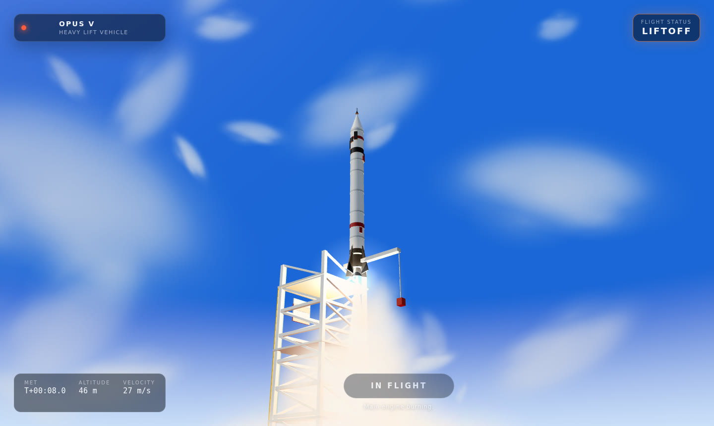
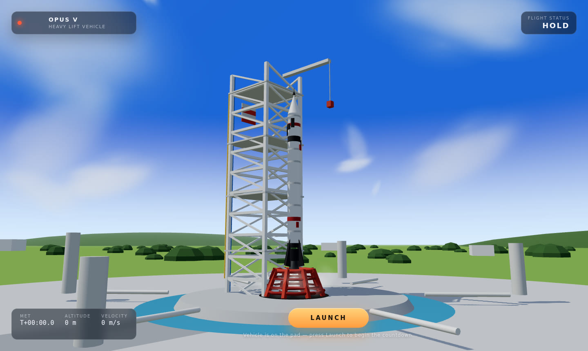
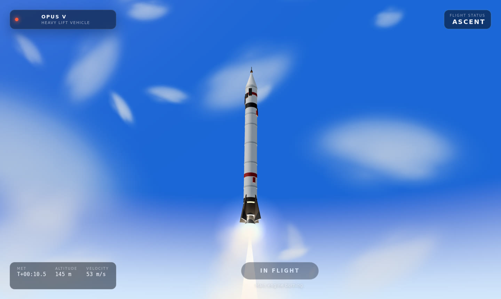
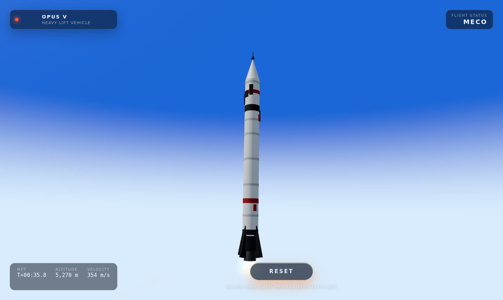

# Orbital Launch — 3D Rocket Experience

A stylized, browser-based 3D rocket launch experience built with React, Three.js
and React Three Fiber. Everything in the scene — the launch vehicle, the service
tower, the launch mount, the terrain and the exhaust smoke — is generated
procedurally at runtime, so the app ships no external 3D or texture assets.



## What it does

Press **Launch** and the vehicle runs a complete launch sequence:

1. **Hold** — the rocket sits on the hold-down mount with cryogenic vapour
   venting around the pad.
2. **Ignition** — the engine spools up, the plume flickers to life, exhaust
   lighting washes over the mount and the tower, and billowing smoke spreads
   across the pad.
3. **Liftoff** — the rocket rises slowly out of the tower as the smoke cloud
   grows and drifts.
4. **Ascent** — the vehicle accelerates away from the launch site while the
   camera hands over from a ground vantage to a tracking shot, with clouds
   streaking past and engine rumble shaking the frame.
5. **MECO** — thrust cuts off; press **Reset** to return to the pad and fly
   again.

Live telemetry (mission elapsed time, altitude, velocity) is shown in the HUD.

| On the pad | Ascent | Main engine cutoff |
| --- | --- | --- |
|  |  |  |

## Running locally

```bash
npm install
npm run dev
```

Then open the printed local URL. To check the production build:

```bash
npm run build
npm run preview
```

## Project layout

```
src/
  launch/     launch clock, flight phases and the per-frame simulation step
  scene/      sky, terrain, clouds, pad, tower, vehicle, exhaust and camera rig
  hud/        overlay chrome, telemetry and launch controls
```

The flight timeline is defined by closed-form altitude/velocity curves in
`src/launch/timeline.ts`, which keeps the whole sequence deterministic and lets
each visual system (plume, smoke, lighting, camera) read the same clock without
extra state.

## Notes

- Requires WebGL2. Runs in current desktop browsers; the scene is tuned for
  smooth frame rates and uses a single instanced draw call for the smoke field.
- The reference video's split-screen "before/now" comparison is an editing
  overlay and is intentionally not part of the UI.

---

Built with `DeepSeek-V4.1-Flash` using OpenCode Harness.
